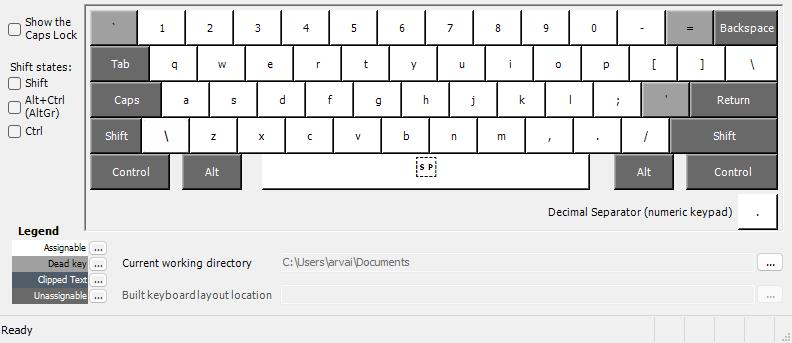

# What's this?

This is the keyboard layout I use on all my computers. It's based on the US international layout but with additional [dead keys](https://en.wikipedia.org/wiki/Dead_key) for the Hungarian letters `ő` and `ű`.

